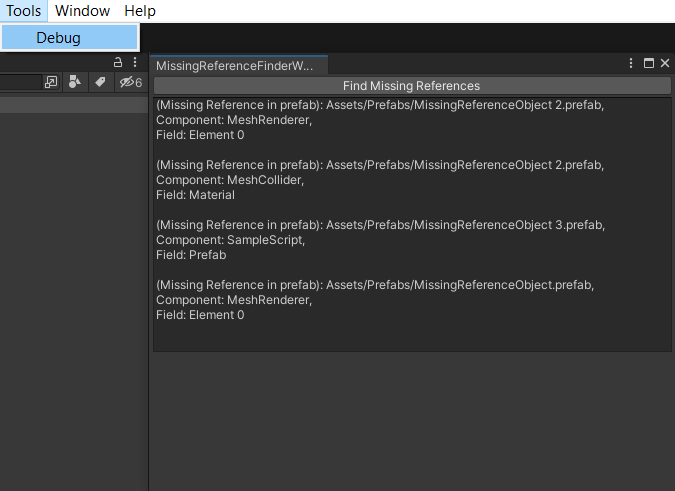

# Missing References Finder

Для поиска missing-ссылок в префабах берется SerializedObject каждого компонента и проверяются все его serializedProperty на то, является ли это свойство ссылкой, равно null и его ReferenceInstanceIDValue не равен 0 (Потому что у None он равен 0)

